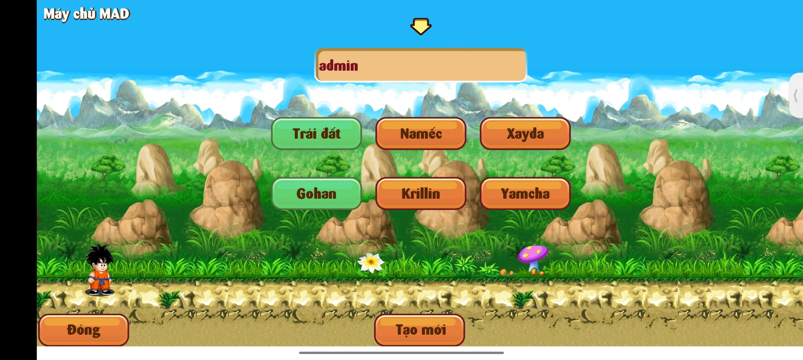
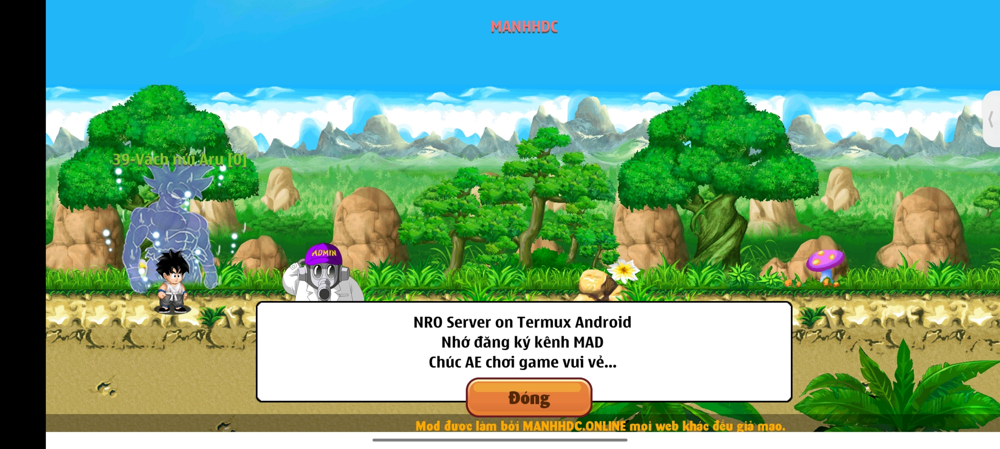
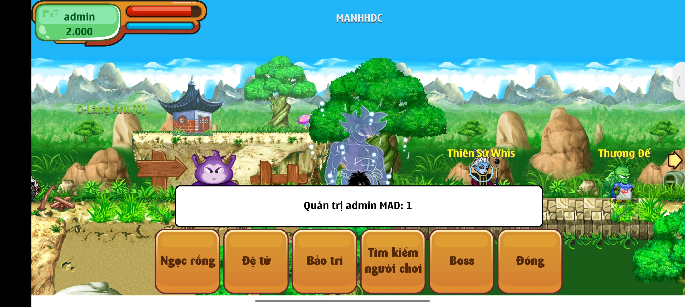
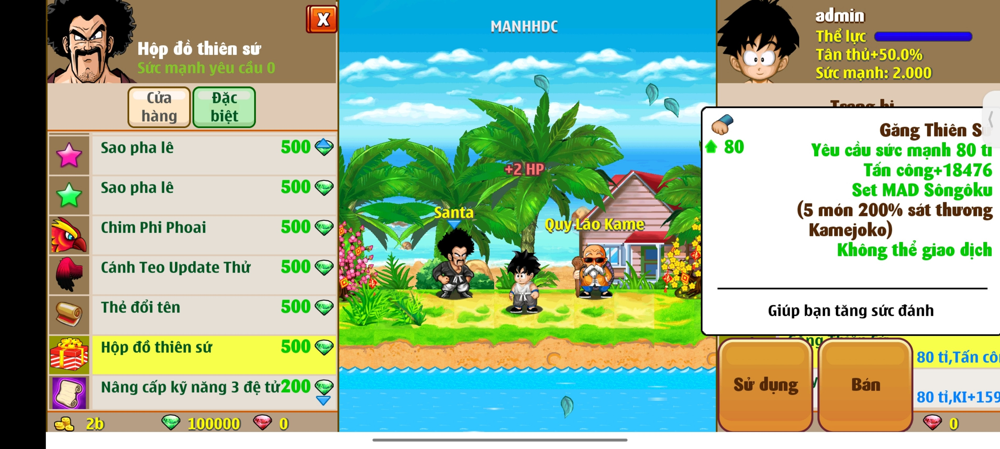
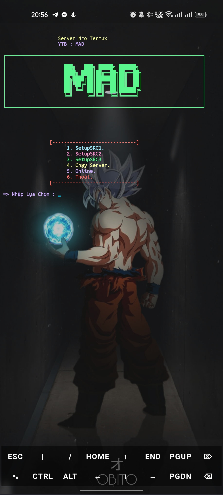

<br/>
<p align="center">
  <a href="https://github.com/Mad-Neko/Nro-Offline">
    
  </a>

  <h3 align="center">NRO-OFFLINE</h3>

  <p align="center">
    Ngọc Rồng Offline là Trò Chơi Ngoại Tuyến với cốt truyện xoay quanh bộ truyện tranh 7 viên Ngọc Rồng. Người chơi sẽ hóa thân thành một trong những anh hùng của 3 hành tinh: Trái Đất, Xayda, Namếc.Luyện tập, tăng cường sức mạnh và kỹ năng. Đoàn kết cùng chiến đấu chống lại các thế lực hung ác.
    <br/>
    <br/>
    <a href="https://github.com/Mad-Neko/Nro-Offline"><strong>Explore the docs »</strong></a>
    <br/>
    <br/>
    <a href="https://github.com/Mad-Neko/Nro-Offline">View Demo</a>
    .
    <a href="https://github.com/Mad-Neko/Nro-Offline/issues">Report Bug</a>
    .
    <a href="https://github.com/Mad-Neko/Nro-Offline/issues">Request Feature</a>
  </p>
</p>

     

## Table Of Contents

* [About the Project](#about-the-project)
* [Built With](#built-with)
* [Getting Started](#getting-started)
  * [Prerequisites](#prerequisites)
  * [Installation](#installation)
  *  [Run](#run)
* [Usage](#usage)
* [Contributing](#contributing)
* [Authors](#authors)
* [Acknowledgements](#acknowledgements)

## About The Project



- Action category, Role. Direct control action figure. Easy to play, easy to control character. Sharp graphics. High graphics version for mobile phones and reliable pixel version for low profile machines.


- Plot Close to original . Players will face all the characters from Bunma, Master Roshi, Jacky-chun, Tau PAY PAY ... to Fide, Pic, POC, Xen, Broly, Bojack team.


- Best Features: Join hit barracks independent label. Join martial arts congress. Join the hunt for the dragon balls to bring the pact yourself.


- Available on all in the market today Namely: PC Computers, Nokia Java Phones, Android, iPhone, Windows Phone and Android tablets, iPad.

## Built With

NRO Server on Termux Android

## Getting Started

 - Download APK (click on Picture): 
<a href="http://d.icdown.club/repository/main/ZeroTermux/ZeroTermux-0.118.32.apk" target="_blank">
</a>


### Prerequisites

This is an example of how to list things you need to use the software and how to install them.

* Open Termux, copy this line and paste it on Termux

```
apt-get update

apt-get upgrade

termux-setup-storage

apt-get install curl bc git zip wget ncurses-utils

git clone https://github.com/Mad-Neko/Nro-Offline

cd Nro-Offline

```
### Installation

```
bash install.sh
```



1 - Choose Source and  Wait for install!
 
3- Enjoy!
### Run
1 Run server

```
dragon
```
2 Open Menu

```
menu
```

## Usage

1. Sign up account

- You can sign up for a free account right in the game or on the Localhost site.

2. Some basic information

- Senzu bean is used to increase KI and HP.
- You can only bring 10 seeds, if you want to bring more, please ask someone in your clan.
- To increase your abilities and skills, you can register for free training at Master Kame, if you have enough potential points.
- You cannot use flying skills if all KI is used up.
- Big raid with friends will add more hit points and potential.
- Practice with friends in the right area will bring more potential.
- When the bean is upgraded, the bean will recover more HP and KI.
- On regular match days, if you win you can get free gems.
- Chicken thighs will recover 100% HP KI. Tomato recovers 100% KI. Carrot recovers 100% HP.
- The Senzu bean tree continues to bear fruit after a while, even if you are offline.
- After 3 days of not participating in the game, you will reduce strength training.
- You will reduce your strength if you are killed by enemies or monsters, but will increase your stamina to fight again.


## Contributing

Contributions are what make the open source community such an amazing place to be learn, inspire, and create. Any contributions you make are **greatly appreciated**.
* If you have suggestions for adding or removing projects, feel free to [open an issue](https://github.com/Mad-Neko/Nro-Offline/issues/new) to discuss it, or directly create a pull request after you edit the server with necessary changes.
* Please make sure you check your spelling and grammar.
* Create individual PR for each suggestion.
* Please also read through the [Code Of Conduct](https://github.com/Mad-Neko/Nro-Offline/blob/main/CODE_OF_CONDUCT.md) before posting your first idea as well.


## Authors

* **MAD** - *Dev* - [MAD](https://github.com/Mad-Neko/) - *Nro Offline Termux*
* **** - ** - []() - **
* **** - ** - []() - **

## Acknowledgements

* [NRO Offline ](https://github.com/Mad-Neko/Nro-Offline)
* [NSO Offline](coming soon)
* [HSO Offline](coming soon)

